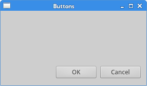

# 布局管理

在一个GUI程序里，布局是一个很重要的方面。布局就是如何管理应用中的元素和窗口。有两种方式可以搞定：绝对定位和PyQt5的布局类

## 绝对定位
每个程序都是以像素为单位区分元素的位置，衡量元素的大小。所以我们完全可以使用绝对定位搞定每个元素和窗口的位置。但是这也有局限性：

 - 元素不会随着我们更改窗口的位置和大小而变化。
 - 不能适用于不同的平台和不同分辨率的显示器
 - 更改应用字体大小会破坏布局
 - 如果我们决定重构这个应用，需要全部计算一下每个元素的位置和大小

下面这个就是绝对定位的应用
```
#!/usr/bin/python3
# -*- coding: utf-8 -*-

"""
ZetCode PyQt5 tutorial 

This example shows three labels on a window
using absolute positioning. 

author: Jan Bodnar
website: zetcode.com 
last edited: January 2015
"""

import sys
from PyQt5.QtWidgets import QWidget, QLabel, QApplication


class Example(QWidget):
    
    def __init__(self):
        super().__init__()
        
        self.initUI()
        
        
    def initUI(self):
        
        lbl1 = QLabel('Zetcode', self)
        lbl1.move(15, 10)

        lbl2 = QLabel('tutorials', self)
        lbl2.move(35, 40)
        
        lbl3 = QLabel('for programmers', self)
        lbl3.move(55, 70)        
        
        self.setGeometry(300, 300, 250, 150)
        self.setWindowTitle('Absolute')    
        self.show()
        
        
if __name__ == '__main__':
    
    app = QApplication(sys.argv)
    ex = Example()
    sys.exit(app.exec_())
```
我们使用move()方法定位了每一个元素，使用x、y坐标。x、y坐标的原点是程序的左上角。
```
lbl1 = QLabel('Zetcode', self)
lbl1.move(15, 10)
```
这个元素的左上角就在这个程序的左上角开始的(15, 10)的位置。

程序展示：


## 盒布局
使用盒布局能让程序具有更强的适应性。这个才是布局一个应用的更合适的方式。QHBoxLayout和QVBoxLayout是基本的布局类，分别是水平布局和垂直布局。

如果我们需要把两个按钮放在程序的右下角，创建这样的布局，我们只需要一个水平布局加一个垂直布局的盒子就可以了。再用弹性布局增加一点间隙。
```
#!/usr/bin/python3
# -*- coding: utf-8 -*-

"""
ZetCode PyQt5 tutorial 

In this example, we position two push
buttons in the bottom-right corner 
of the window. 

author: Jan Bodnar
website: zetcode.com 
last edited: January 2015
"""

import sys
from PyQt5.QtWidgets import (QWidget, QPushButton, 
    QHBoxLayout, QVBoxLayout, QApplication)


class Example(QWidget):
    
    def __init__(self):
        super().__init__()
        
        self.initUI()
        
        
    def initUI(self):
        
        okButton = QPushButton("OK")
        cancelButton = QPushButton("Cancel")

        hbox = QHBoxLayout()
        hbox.addStretch(1)
        hbox.addWidget(okButton)
        hbox.addWidget(cancelButton)

        vbox = QVBoxLayout()
        vbox.addStretch(1)
        vbox.addLayout(hbox)
        
        self.setLayout(vbox)    
        
        self.setGeometry(300, 300, 300, 150)
        self.setWindowTitle('Buttons')    
        self.show()
        
        
if __name__ == '__main__':
    
    app = QApplication(sys.argv)
    ex = Example()
    sys.exit(app.exec_())
```
上面的例子完成了在应用的右下角放了两个按钮的需求。当改变窗口大小的时候，它们能依然保持在相对的位置。我们同时使用了HBoxLayout和QVBoxLayout。
```
okButton = QPushButton("OK")
cancelButton = QPushButton("Cancel")
```
这是创建了两个按钮。
```
hbox = QHBoxLayout()
hbox.addStretch(1)
hbox.addWidget(okButton)
hbox.addWidget(cancelButton)
```
创建一个水平布局，增加两个按钮和弹性空间。stretch函数在两个按钮前面增加了一些弹性空间。下一步我们把这些元素放在应用的右下角。
```
vbox = QVBoxLayout()
vbox.addStretch(1)
vbox.addLayout(hbox)
```
为了布局需要，我们把这个水平布局放到了一个垂直布局盒里面。弹性元素会把所有的元素一起都放置在应用的右下角。
```
self.setLayout(vbox)
```
最后，我们就得到了我们想要的布局。

程序预览：



## 栅格布局

最常用的还是栅格布局了。这种布局是把窗口分为行和列。创建和使用栅格布局，需要使用QGridLayout模块。
```
#!/usr/bin/python3
# -*- coding: utf-8 -*-

"""
ZetCode PyQt5 tutorial 

In this example, we create a skeleton
of a calculator using a QGridLayout.

author: Jan Bodnar
website: zetcode.com 
last edited: January 2015
"""

import sys
from PyQt5.QtWidgets import (QWidget, QGridLayout, 
    QPushButton, QApplication)


class Example(QWidget):
    
    def __init__(self):
        super().__init__()
        
        self.initUI()
        
        
    def initUI(self):
        
        grid = QGridLayout()
        self.setLayout(grid)
 
        names = ['Cls', 'Bck', '', 'Close',
                 '7', '8', '9', '/',
                '4', '5', '6', '*',
                 '1', '2', '3', '-',
                '0', '.', '=', '+']
        
        positions = [(i,j) for i in range(5) for j in range(4)]
        
        for position, name in zip(positions, names):
            
            if name == '':
                continue
            button = QPushButton(name)
            grid.addWidget(button, *position)
            
        self.move(300, 150)
        self.setWindowTitle('Calculator')
        self.show()
        
        
if __name__ == '__main__':
    
    app = QApplication(sys.argv)
    ex = Example()
    sys.exit(app.exec_())
```
这个例子里，我们创建了栅格化的按钮。
```
grid = QGridLayout()
self.setLayout(grid)
```
创建一个QGridLayout实例，并把它放到程序窗口里。
```
names = ['Cls', 'Bck', '', 'Close',
        '7', '8', '9', '/',
        '4', '5', '6', '*',
        '1', '2', '3', '-',
        '0', '.', '=', '+']
```
这是我们将要使用的按钮的名称。
```
positions = [(i,j) for i in range(5) for j in range(4)]
```
创建按钮位置列表。
```
for position, name in zip(positions, names):
    
    if name == '':
        continue
    button = QPushButton(name)
    grid.addWidget(button, *position)
```
创建按钮，并使用addWidget()方法把按钮放到布局里面。

程序预览：


## 制作反馈信息提交布局
组件能跨列和跨行展示，这个例子里，我们就试试这个功能。
```
#!/usr/bin/python3
# -*- coding: utf-8 -*-

"""
ZetCode PyQt5 tutorial 

In this example, we create a bit
more complicated window layout using
the QGridLayout manager. 

author: Jan Bodnar
website: zetcode.com 
last edited: January 2015
"""

import sys
from PyQt5.QtWidgets import (QWidget, QLabel, QLineEdit, 
    QTextEdit, QGridLayout, QApplication)


class Example(QWidget):
    
    def __init__(self):
        super().__init__()
        
        self.initUI()
        
        
    def initUI(self):
        
        title = QLabel('Title')
        author = QLabel('Author')
        review = QLabel('Review')

        titleEdit = QLineEdit()
        authorEdit = QLineEdit()
        reviewEdit = QTextEdit()

        grid = QGridLayout()
        grid.setSpacing(10)

        grid.addWidget(title, 1, 0)
        grid.addWidget(titleEdit, 1, 1)

        grid.addWidget(author, 2, 0)
        grid.addWidget(authorEdit, 2, 1)

        grid.addWidget(review, 3, 0)
        grid.addWidget(reviewEdit, 3, 1, 5, 1)
        
        self.setLayout(grid) 
        
        self.setGeometry(300, 300, 350, 300)
        self.setWindowTitle('Review')    
        self.show()
        
        
if __name__ == '__main__':
    
    app = QApplication(sys.argv)
    ex = Example()
    sys.exit(app.exec_())
```
我们创建了一个有三个标签的窗口。两个行编辑和一个文版编辑，这是用QGridLayout模块搞定的。
```
grid = QGridLayout()
grid.setSpacing(10)
```
创建标签之间的空间。
```
grid.addWidget(reviewEdit, 3, 1, 5, 1)
```
我们可以指定组件的跨行和跨列的大小。这里我们指定这个元素跨5列显示。

程序预览：

