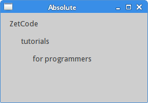

# 布局管理

在一个GUI程序里，布局是一个很重要的方面。布局就是如何管理应用中的元素和窗口。有两种方式可以搞定：绝对定位和PyQt5的布局类

## 绝对定位
每个程序都是以像素为单位区分元素的位置，衡量元素的大小。所以我们完全可以使用绝对定位搞定每个元素和窗口的位置。但是这也有局限性：

 - 元素不会随着我们更改窗口的位置和大小而变化。
 - 不能适用于不同的平台和不同分辨率的显示器
 - 更改应用字体大小会破坏布局
 - 如果我们决定重构这个应用，需要全部计算一下每个元素的位置和大小

下面这个就是绝对定位的应用
```
#!/usr/bin/python3
# -*- coding: utf-8 -*-

"""
ZetCode PyQt5 tutorial 

This example shows three labels on a window
using absolute positioning. 

author: Jan Bodnar
website: zetcode.com 
last edited: January 2015
"""

import sys
from PyQt5.QtWidgets import QWidget, QLabel, QApplication


class Example(QWidget):
    
    def __init__(self):
        super().__init__()
        
        self.initUI()
        
        
    def initUI(self):
        
        lbl1 = QLabel('Zetcode', self)
        lbl1.move(15, 10)

        lbl2 = QLabel('tutorials', self)
        lbl2.move(35, 40)
        
        lbl3 = QLabel('for programmers', self)
        lbl3.move(55, 70)        
        
        self.setGeometry(300, 300, 250, 150)
        self.setWindowTitle('Absolute')    
        self.show()
        
        
if __name__ == '__main__':
    
    app = QApplication(sys.argv)
    ex = Example()
    sys.exit(app.exec_())
```
我们使用move()方法定位了每一个元素，使用x、y坐标。x、y坐标的原点是程序的左上角。
```
lbl1 = QLabel('Zetcode', self)
lbl1.move(15, 10)
```
这个元素的左上角就在这个程序的左上角开始的(15, 10)的位置。

程序展示：



## 盒布局
使用盒布局能让程序具有更强的适应性。这个才是布局一个应用的更合适的方式。QHBoxLayout和QVBoxLayout是基本的布局类，分别是水平布局和垂直布局。

想象一下，如果我们需要把两个按钮放在程序的右下角
Imagine that we wanted to place two buttons in the right bottom corner. To create such a layout, we will use one horizontal and one vertical box. To create the necessary space, we will add a stretch factor.

#!/usr/bin/python3
# -*- coding: utf-8 -*-

"""
ZetCode PyQt5 tutorial 

In this example, we position two push
buttons in the bottom-right corner 
of the window. 

author: Jan Bodnar
website: zetcode.com 
last edited: January 2015
"""

import sys
from PyQt5.QtWidgets import (QWidget, QPushButton, 
    QHBoxLayout, QVBoxLayout, QApplication)


class Example(QWidget):
    
    def __init__(self):
        super().__init__()
        
        self.initUI()
        
        
    def initUI(self):
        
        okButton = QPushButton("OK")
        cancelButton = QPushButton("Cancel")

        hbox = QHBoxLayout()
        hbox.addStretch(1)
        hbox.addWidget(okButton)
        hbox.addWidget(cancelButton)

        vbox = QVBoxLayout()
        vbox.addStretch(1)
        vbox.addLayout(hbox)
        
        self.setLayout(vbox)    
        
        self.setGeometry(300, 300, 300, 150)
        self.setWindowTitle('Buttons')    
        self.show()
        
        
if __name__ == '__main__':
    
    app = QApplication(sys.argv)
    ex = Example()
    sys.exit(app.exec_())
The example places two buttons in the bottom-right corner of the window. They stay there when we resize the application window. We use both a HBoxLayout and a QVBoxLayout.

okButton = QPushButton("OK")
cancelButton = QPushButton("Cancel")
Here we create two push buttons.

hbox = QHBoxLayout()
hbox.addStretch(1)
hbox.addWidget(okButton)
hbox.addWidget(cancelButton)
We create a horizontal box layout and add a stretch factor and both buttons. The stretch adds a stretchable space before the two buttons. This will push them to the right of the window.

vbox = QVBoxLayout()
vbox.addStretch(1)
vbox.addLayout(hbox)
To create the necessary layout, we put a horizontal layout into a vertical one. The stretch factor in the vertical box will push the horizontal box with the buttons to the bottom of the window.

self.setLayout(vbox)
Finally, we set the main layout of the window.

Buttons
Figure: Buttons
QGridLayout

The most universal layout class is the grid layout. This layout divides the space into rows and columns. To create a grid layout, we use the QGridLayout class.

#!/usr/bin/python3
# -*- coding: utf-8 -*-

"""
ZetCode PyQt5 tutorial 

In this example, we create a skeleton
of a calculator using a QGridLayout.

author: Jan Bodnar
website: zetcode.com 
last edited: January 2015
"""

import sys
from PyQt5.QtWidgets import (QWidget, QGridLayout, 
    QPushButton, QApplication)


class Example(QWidget):
    
    def __init__(self):
        super().__init__()
        
        self.initUI()
        
        
    def initUI(self):
        
        grid = QGridLayout()
        self.setLayout(grid)
 
        names = ['Cls', 'Bck', '', 'Close',
                 '7', '8', '9', '/',
                '4', '5', '6', '*',
                 '1', '2', '3', '-',
                '0', '.', '=', '+']
        
        positions = [(i,j) for i in range(5) for j in range(4)]
        
        for position, name in zip(positions, names):
            
            if name == '':
                continue
            button = QPushButton(name)
            grid.addWidget(button, *position)
            
        self.move(300, 150)
        self.setWindowTitle('Calculator')
        self.show()
        
        
if __name__ == '__main__':
    
    app = QApplication(sys.argv)
    ex = Example()
    sys.exit(app.exec_())
In our example, we create a grid of buttons.

grid = QGridLayout()
self.setLayout(grid)
The instance of a QGridLayout is created and set to be the layout for the application window.

names = ['Cls', 'Bck', '', 'Close',
            '7', '8', '9', '/',
        '4', '5', '6', '*',
            '1', '2', '3', '-',
        '0', '.', '=', '+']
These are the labels used later for buttons.

positions = [(i,j) for i in range(5) for j in range(4)]
We create a list of positions in the grid.

for position, name in zip(positions, names):
    
    if name == '':
        continue
    button = QPushButton(name)
    grid.addWidget(button, *position)
Buttons are created and added to the layout with the addWidget() method.

Calculator skeleton
Figure: Calculator skeleton
Review example

Widgets can span multiple columns or rows in a grid. In the next example we illustrate this.

#!/usr/bin/python3
# -*- coding: utf-8 -*-

"""
ZetCode PyQt5 tutorial 

In this example, we create a bit
more complicated window layout using
the QGridLayout manager. 

author: Jan Bodnar
website: zetcode.com 
last edited: January 2015
"""

import sys
from PyQt5.QtWidgets import (QWidget, QLabel, QLineEdit, 
    QTextEdit, QGridLayout, QApplication)


class Example(QWidget):
    
    def __init__(self):
        super().__init__()
        
        self.initUI()
        
        
    def initUI(self):
        
        title = QLabel('Title')
        author = QLabel('Author')
        review = QLabel('Review')

        titleEdit = QLineEdit()
        authorEdit = QLineEdit()
        reviewEdit = QTextEdit()

        grid = QGridLayout()
        grid.setSpacing(10)

        grid.addWidget(title, 1, 0)
        grid.addWidget(titleEdit, 1, 1)

        grid.addWidget(author, 2, 0)
        grid.addWidget(authorEdit, 2, 1)

        grid.addWidget(review, 3, 0)
        grid.addWidget(reviewEdit, 3, 1, 5, 1)
        
        self.setLayout(grid) 
        
        self.setGeometry(300, 300, 350, 300)
        self.setWindowTitle('Review')    
        self.show()
        
        
if __name__ == '__main__':
    
    app = QApplication(sys.argv)
    ex = Example()
    sys.exit(app.exec_())
We create a window in which we have three labels, two line edits and one text edit widget. The layout is done with the QGridLayout.

grid = QGridLayout()
grid.setSpacing(10)
We create a grid layout and set spacing between widgets.

grid.addWidget(reviewEdit, 3, 1, 5, 1)
If we add a widget to a grid, we can provide row span and column span of the widget. In our case, we make the reviewEdit widget span 5 rows.

Review example
Figure: Review example
This part of the PyQt5 tutorial was dedicated to layout management.