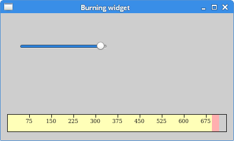

# 自定义控件

PyQt5有丰富的组件，但是还是满足不了所有开发者的所有需求的，PyQt5只提供了基本的组件，像按钮，文本，滑块等。如果你还需要其他的模块，应该尝试自己去自定义一些。

自定义组件使用绘画工具创建，有两个基本方式：根据已有的创建或改进；通过自己绘图创建。

## Burning widget

这个组件我们会在Nero，K3B，或者其他CD/DVD烧录软件中见到。
```
#!/usr/bin/python3
# -*- coding: utf-8 -*-

"""
ZetCode PyQt5 tutorial 

In this example, we create a custom widget.

author: Jan Bodnar
website: zetcode.com 
last edited: January 2015
"""

import sys
from PyQt5.QtWidgets import (QWidget, QSlider, QApplication, 
    QHBoxLayout, QVBoxLayout)
from PyQt5.QtCore import QObject, Qt, pyqtSignal
from PyQt5.QtGui import QPainter, QFont, QColor, QPen


class Communicate(QObject):
    
    updateBW = pyqtSignal(int)


class BurningWidget(QWidget):
  
    def __init__(self):      
        super().__init__()
        
        self.initUI()
        
        
    def initUI(self):
        
        self.setMinimumSize(1, 30)
        self.value = 75
        self.num = [75, 150, 225, 300, 375, 450, 525, 600, 675]


    def setValue(self, value):

        self.value = value


    def paintEvent(self, e):
      
        qp = QPainter()
        qp.begin(self)
        self.drawWidget(qp)
        qp.end()
      
      
    def drawWidget(self, qp):
      
        font = QFont('Serif', 7, QFont.Light)
        qp.setFont(font)

        size = self.size()
        w = size.width()
        h = size.height()

        step = int(round(w / 10.0))


        till = int(((w / 750.0) * self.value))
        full = int(((w / 750.0) * 700))

        if self.value >= 700:
            
            qp.setPen(QColor(255, 255, 255))
            qp.setBrush(QColor(255, 255, 184))
            qp.drawRect(0, 0, full, h)
            qp.setPen(QColor(255, 175, 175))
            qp.setBrush(QColor(255, 175, 175))
            qp.drawRect(full, 0, till-full, h)
            
        else:
            
            qp.setPen(QColor(255, 255, 255))
            qp.setBrush(QColor(255, 255, 184))
            qp.drawRect(0, 0, till, h)


        pen = QPen(QColor(20, 20, 20), 1, 
            Qt.SolidLine)
            
        qp.setPen(pen)
        qp.setBrush(Qt.NoBrush)
        qp.drawRect(0, 0, w-1, h-1)

        j = 0

        for i in range(step, 10*step, step):
          
            qp.drawLine(i, 0, i, 5)
            metrics = qp.fontMetrics()
            fw = metrics.width(str(self.num[j]))
            qp.drawText(i-fw/2, h/2, str(self.num[j]))
            j = j + 1
            

class Example(QWidget):
    
    def __init__(self):
        super().__init__()
        
        self.initUI()
        
        
    def initUI(self):      

        sld = QSlider(Qt.Horizontal, self)
        sld.setFocusPolicy(Qt.NoFocus)
        sld.setRange(1, 750)
        sld.setValue(75)
        sld.setGeometry(30, 40, 150, 30)

        self.c = Communicate()        
        self.wid = BurningWidget()
        self.c.updateBW[int].connect(self.wid.setValue)

        sld.valueChanged[int].connect(self.changeValue)
        hbox = QHBoxLayout()
        hbox.addWidget(self.wid)
        vbox = QVBoxLayout()
        vbox.addStretch(1)
        vbox.addLayout(hbox)
        self.setLayout(vbox)
        
        self.setGeometry(300, 300, 390, 210)
        self.setWindowTitle('Burning widget')
        self.show()
        
        
    def changeValue(self, value):
             
        self.c.updateBW.emit(value)        
        self.wid.repaint()
        
        
if __name__ == '__main__':
    
    app = QApplication(sys.argv)
    ex = Example()
    sys.exit(app.exec_())
```
本例中，我们使用了`QSlider`和一个自定义组件，由进度条控制。显示的有物体（也就是CD/DVD）的总容量和剩余容量。进度条的范围是1~750。如果值达到了700，就显示为红色，代表了烧毁了的意思。

烧录组件在窗口的底部，这个组件是用`QHBoxLayout`和`QVBoxLayout`组成的。
```
class BurningWidget(QWidget):
  
    def __init__(self):      
        super().__init__()        
```
烧录组件是基于`QWidget`组件做的。
```
self.setMinimumSize(1, 30)
```
修改组件进度条的高度，默认的有点小了。
```
font = QFont('Serif', 7, QFont.Light)
qp.setFont(font)
```
使用比默认更小一点的字体，这样更配。
```
size = self.size()
w = size.width()
h = size.height()

step = int(round(w / 10.0))


till = int(((w / 750.0) * self.value))
full = int(((w / 750.0) * 700))
```
动态的渲染组件，随着窗口的大小而变化，这就是我们计算窗口大小的原因。最后一个参数决定了组件的最大范围，进度条的值是由窗口大小按比例计算出来的。最大值的地方填充的是红色。注意这里使用的是浮点数，能提高计算和渲染的精度。

绘画由三部分组成，黄色或红色区域和黄色矩形，然后是分割线，最后是添上代表容量的数字。
```
metrics = qp.fontMetrics()
fw = metrics.width(str(self.num[j]))
qp.drawText(i-fw/2, h/2, str(self.num[j]))
```
这里使用字体去渲染文本。必须要知道文本的宽度，这样才能让文本的中间点正好落在竖线上。
```
def changeValue(self, value):
          
    self.c.updateBW.emit(value)        
    self.wid.repaint()
```
拖动滑块的时候，调用了`changeValue()`方法。这个方法内部，我们自定义了一个可以传参的updateBW信号。参数就是滑块的当前位置。这个数值之后还用来于Burning组件，然后重新渲染Burning组件。

