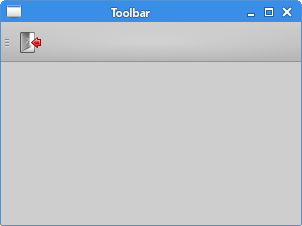

# 菜单和工具栏
这个章节，我们会创建菜单和工具栏。菜单是一组位于菜单栏的命令。工具栏是应用的一些常用工具按钮。

## 主窗口
QMainWindow提供了主窗口的功能，使用它能创建一些简单的状态栏、工具栏和菜单栏。

主窗口是下面这些窗口的合称，所以教程在最下方。

## 状态栏

状态栏是用来显示应用的状态信息的组件。
```
#!/usr/bin/python3
# -*- coding: utf-8 -*-

"""
ZetCode PyQt5 tutorial 

This program creates a statusbar.

author: Jan Bodnar
website: zetcode.com 
last edited: January 2015
"""

import sys
from PyQt5.QtWidgets import QMainWindow, QApplication


class Example(QMainWindow):
    
    def __init__(self):
        super().__init__()
        
        self.initUI()
        
        
    def initUI(self):               
        
        self.statusBar().showMessage('Ready')
        
        self.setGeometry(300, 300, 250, 150)
        self.setWindowTitle('Statusbar')    
        self.show()


if __name__ == '__main__':
    
    app = QApplication(sys.argv)
    ex = Example()
    sys.exit(app.exec_())
```
状态栏是由QMainWindow创建的。
```
self.statusBar().showMessage('Ready')
```
调用QtGui.QMainWindow类的statusBar()方法，创建状态栏。第一次调用创建一个状态栏，返回一个状态栏对象。showMessage()方法在状态栏上显示一条信息。

## 菜单栏
菜单栏是非常常用的。是一组命令的集合（Mac OS下状态栏的显示不一样，为了得到最相似的外观，我们增加了一句menubar.setNativeMenuBar(False))。
```
#!/usr/bin/python3
# -*- coding: utf-8 -*-

"""
ZetCode PyQt5 tutorial 

This program creates a menubar. The
menubar has one menu with an exit action.

author: Jan Bodnar
website: zetcode.com 
last edited: January 2015
"""

import sys
from PyQt5.QtWidgets import QMainWindow, QAction, qApp, QApplication
from PyQt5.QtGui import QIcon


class Example(QMainWindow):
    
    def __init__(self):
        super().__init__()
        
        self.initUI()
        
        
    def initUI(self):               
        
        exitAction = QAction(QIcon('exit.png'), '&Exit', self)        
        exitAction.setShortcut('Ctrl+Q')
        exitAction.setStatusTip('Exit application')
        exitAction.triggered.connect(qApp.quit)

        self.statusBar()

        menubar = self.menuBar()
        fileMenu = menubar.addMenu('&File')
        fileMenu.addAction(exitAction)
        
        self.setGeometry(300, 300, 300, 200)
        self.setWindowTitle('Menubar')    
        self.show()
        
        
if __name__ == '__main__':
    
    app = QApplication(sys.argv)
    ex = Example()
    sys.exit(app.exec_())
```
我们创建了只有一个命令的菜单栏，这个命令就是终止应用。同时也创建了一个状态栏。而且还能使用快捷键`Ctrl+Q`退出应用。
```
exitAction = QAction(QIcon('exit.png'), '&Exit', self)        
exitAction.setShortcut('Ctrl+Q')
exitAction.setStatusTip('Exit application')
```
QAction是菜单栏、工具栏或者快捷键的动作的组合。前面两行，我们创建了一个图标、一个exit的标签和一个快捷键组合，都执行了一个动作。第三行，创建了一个状态栏，当鼠标悬停在菜单栏的时候，能显示当前状态。
```
exitAction.triggered.connect(qApp.quit)
```
当执行这个指定的动作时，就触发了一个事件。这个事件跟QApplication的quit()行为相关联，所以这个动作就能终止这个应用。
```
menubar = self.menuBar()
fileMenu = menubar.addMenu('&File')
fileMenu.addAction(exitAction)
```
menuBar()创建菜单栏。这里创建了一个菜单栏，并在上面添加了一个file菜单，并关联了点击退出应用的事件。

## 工具栏
菜单栏包含了所有的命令，工具栏就是常用的命令的集合。
```
#!/usr/bin/python3
# -*- coding: utf-8 -*-

"""
ZetCode PyQt5 tutorial 

This program creates a toolbar.
The toolbar has one action, which
terminates the application, if triggered.

author: Jan Bodnar
website: zetcode.com 
last edited: January 2015
"""

import sys
from PyQt5.QtWidgets import QMainWindow, QAction, qApp, QApplication
from PyQt5.QtGui import QIcon


class Example(QMainWindow):
    
    def __init__(self):
        super().__init__()
        
        self.initUI()
        
        
    def initUI(self):               
        
        exitAction = QAction(QIcon('exit24.png'), 'Exit', self)
        exitAction.setShortcut('Ctrl+Q')
        exitAction.triggered.connect(qApp.quit)
        
        self.toolbar = self.addToolBar('Exit')
        self.toolbar.addAction(exitAction)
        
        self.setGeometry(300, 300, 300, 200)
        self.setWindowTitle('Toolbar')    
        self.show()
        
        
if __name__ == '__main__':
    
    app = QApplication(sys.argv)
    ex = Example()
    sys.exit(app.exec_())
```
In the above example, we create a simple toolbar. The toolbar has one tool action, an exit action which terminates the application when triggered.

exitAction = QAction(QIcon('exit24.png'), 'Exit', self)
exitAction.setShortcut('Ctrl+Q')
exitAction.triggered.connect(qApp.quit)
Similar to the menubar example above, we create an action object. The object has a label, icon, and a shorcut. A quit() method of the QtGui.QMainWindow is connected to the triggered signal.

self.toolbar = self.addToolBar('Exit')
self.toolbar.addAction(exitAction)
Here we create a toolbar and plug and action object into it.

程序展示：


## 主窗口

In the last example of this section, we will create a menubar, toolbar, and a statusbar. We will also create a central widget.

#!/usr/bin/python3
# -*- coding: utf-8 -*-

"""
ZetCode PyQt5 tutorial 

This program creates a skeleton of
a classic GUI application with a menubar,
toolbar, statusbar, and a central widget. 

author: Jan Bodnar
website: zetcode.com 
last edited: January 2015
"""

import sys
from PyQt5.QtWidgets import QMainWindow, QTextEdit, QAction, QApplication
from PyQt5.QtGui import QIcon


class Example(QMainWindow):
    
    def __init__(self):
        super().__init__()
        
        self.initUI()
        
        
    def initUI(self):               
        
        textEdit = QTextEdit()
        self.setCentralWidget(textEdit)

        exitAction = QAction(QIcon('exit24.png'), 'Exit', self)
        exitAction.setShortcut('Ctrl+Q')
        exitAction.setStatusTip('Exit application')
        exitAction.triggered.connect(self.close)

        self.statusBar()

        menubar = self.menuBar()
        fileMenu = menubar.addMenu('&File')
        fileMenu.addAction(exitAction)

        toolbar = self.addToolBar('Exit')
        toolbar.addAction(exitAction)
        
        self.setGeometry(300, 300, 350, 250)
        self.setWindowTitle('Main window')    
        self.show()
        
        
if __name__ == '__main__':
    
    app = QApplication(sys.argv)
    ex = Example()
    sys.exit(app.exec_())
This code example creates a skeleton of a classic GUI application with a menubar, toolbar, and a statusbar.

textEdit = QTextEdit()
self.setCentralWidget(textEdit)
Here we create a text edit widget. We set it to be the central widget of the QMainWindow. The central widget will occupy all space that is left.

程序展示：


