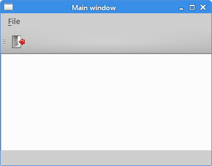

# 菜单和工具栏
这个章节，我们会创建菜单和工具栏。菜单是一组位于菜单栏的命令。工具栏是应用的一些常用工具按钮。

## 主窗口
QMainWindow提供了主窗口的功能，使用它能创建一些简单的状态栏、工具栏和菜单栏。

## 状态栏

状态栏是用来显示应用的状态信息的组件。
A statusbar is a widget that is used for displaying status information.

#!/usr/bin/python3
# -*- coding: utf-8 -*-

"""
ZetCode PyQt5 tutorial 

This program creates a statusbar.

author: Jan Bodnar
website: zetcode.com 
last edited: January 2015
"""

import sys
from PyQt5.QtWidgets import QMainWindow, QApplication

class Example(QMainWindow):
    
    def __init__(self):
        super().__init__()
        
        self.initUI()
        
        
    def initUI(self):               
        
        self.statusBar().showMessage('Ready')
        
        self.setGeometry(300, 300, 250, 150)
        self.setWindowTitle('Statusbar')    
        self.show()

if __name__ == '__main__':
    
    app = QApplication(sys.argv)
    ex = Example()
    sys.exit(app.exec_())
The statusbar is created with the help of the QMainWindow widget.

self.statusBar().showMessage('Ready')
To get the statusbar, we call the statusBar() method of the QtGui.QMainWindow class. The first call of the method creates a status bar. Subsequent calls return the statusbar object. The showMessage() displays a message on the statusbar.

## 菜单栏
A menubar is a common part of a GUI application. It is a group of commands located in various menus. (Mac OS treats menubars differently. To get a similar outcome, we can add the following line: menubar.setNativeMenuBar(False).)

#!/usr/bin/python3
# -*- coding: utf-8 -*-

"""
ZetCode PyQt5 tutorial 

This program creates a menubar. The
menubar has one menu with an exit action.

author: Jan Bodnar
website: zetcode.com 
last edited: January 2015
"""

import sys
from PyQt5.QtWidgets import QMainWindow, QAction, qApp, QApplication
from PyQt5.QtGui import QIcon

class Example(QMainWindow):
    
    def __init__(self):
        super().__init__()
        
        self.initUI()
        
        
    def initUI(self):               
        
        exitAction = QAction(QIcon('exit.png'), '&Exit', self)        
        exitAction.setShortcut('Ctrl+Q')
        exitAction.setStatusTip('Exit application')
        exitAction.triggered.connect(qApp.quit)

        self.statusBar()

        menubar = self.menuBar()
        fileMenu = menubar.addMenu('&File')
        fileMenu.addAction(exitAction)
        
        self.setGeometry(300, 300, 300, 200)
        self.setWindowTitle('Menubar')    
        self.show()
        
        
if __name__ == '__main__':
    
    app = QApplication(sys.argv)
    ex = Example()
    sys.exit(app.exec_())  
In the above example, we create a menubar with one menu. This menu will contain one action which will terminate the application if selected. A statusbar is created as well. The action is accessible with the Ctrl+Q shortcut.

exitAction = QAction(QIcon('exit.png'), '&Exit', self)        
exitAction.setShortcut('Ctrl+Q')
exitAction.setStatusTip('Exit application')
A QAction is an abstraction for actions performed with a menubar, toolbar, or with a custom keyboard shortcut. In the above three lines, we create an action with a specific icon and an 'Exit' label. Furthermore, a shortcut is defined for this action. The third line creates a status tip which is shown in the statusbar when we hover a mouse pointer over the menu item.

exitAction.triggered.connect(qApp.quit)
When we select this particular action, a triggered signal is emitted. The signal is connected to the quit() method of the QApplication widget. This terminates the application.

menubar = self.menuBar()
fileMenu = menubar.addMenu('&File')
fileMenu.addAction(exitAction)
The menuBar() method creates a menubar. We create a file menu and append the exit action to it.

## 工具栏

Menus group all commands that we can use in an application. Toolbars provide a quick access to the most frequently used commands.

#!/usr/bin/python3
# -*- coding: utf-8 -*-

"""
ZetCode PyQt5 tutorial 

This program creates a toolbar.
The toolbar has one action, which
terminates the application, if triggered.

author: Jan Bodnar
website: zetcode.com 
last edited: January 2015
"""

import sys
from PyQt5.QtWidgets import QMainWindow, QAction, qApp, QApplication
from PyQt5.QtGui import QIcon

class Example(QMainWindow):
    
    def __init__(self):
        super().__init__()
        
        self.initUI()
        
        
    def initUI(self):               
        
        exitAction = QAction(QIcon('exit24.png'), 'Exit', self)
        exitAction.setShortcut('Ctrl+Q')
        exitAction.triggered.connect(qApp.quit)
        
        self.toolbar = self.addToolBar('Exit')
        self.toolbar.addAction(exitAction)
        
        self.setGeometry(300, 300, 300, 200)
        self.setWindowTitle('Toolbar')    
        self.show()
        
        
if __name__ == '__main__':
    
    app = QApplication(sys.argv)
    ex = Example()
    sys.exit(app.exec_())
In the above example, we create a simple toolbar. The toolbar has one tool action, an exit action which terminates the application when triggered.

exitAction = QAction(QIcon('exit24.png'), 'Exit', self)
exitAction.setShortcut('Ctrl+Q')
exitAction.triggered.connect(qApp.quit)
Similar to the menubar example above, we create an action object. The object has a label, icon, and a shorcut. A quit() method of the QtGui.QMainWindow is connected to the triggered signal.

self.toolbar = self.addToolBar('Exit')
self.toolbar.addAction(exitAction)
Here we create a toolbar and plug and action object into it.

程序展示：

## 主窗口

In the last example of this section, we will create a menubar, toolbar, and a statusbar. We will also create a central widget.

#!/usr/bin/python3
# -*- coding: utf-8 -*-

"""
ZetCode PyQt5 tutorial 

This program creates a skeleton of
a classic GUI application with a menubar,
toolbar, statusbar, and a central widget. 

author: Jan Bodnar
website: zetcode.com 
last edited: January 2015
"""

import sys
from PyQt5.QtWidgets import QMainWindow, QTextEdit, QAction, QApplication
from PyQt5.QtGui import QIcon

class Example(QMainWindow):
    
    def __init__(self):
        super().__init__()
        
        self.initUI()
        
        
    def initUI(self):               
        
        textEdit = QTextEdit()
        self.setCentralWidget(textEdit)

        exitAction = QAction(QIcon('exit24.png'), 'Exit', self)
        exitAction.setShortcut('Ctrl+Q')
        exitAction.setStatusTip('Exit application')
        exitAction.triggered.connect(self.close)

        self.statusBar()

        menubar = self.menuBar()
        fileMenu = menubar.addMenu('&File')
        fileMenu.addAction(exitAction)

        toolbar = self.addToolBar('Exit')
        toolbar.addAction(exitAction)
        
        self.setGeometry(300, 300, 350, 250)
        self.setWindowTitle('Main window')    
        self.show()
        
        
if __name__ == '__main__':
    
    app = QApplication(sys.argv)
    ex = Example()
    sys.exit(app.exec_())
This code example creates a skeleton of a classic GUI application with a menubar, toolbar, and a statusbar.

textEdit = QTextEdit()
self.setCentralWidget(textEdit)
Here we create a text edit widget. We set it to be the central widget of the QMainWindow. The central widget will occupy all space that is left.

程序展示：

